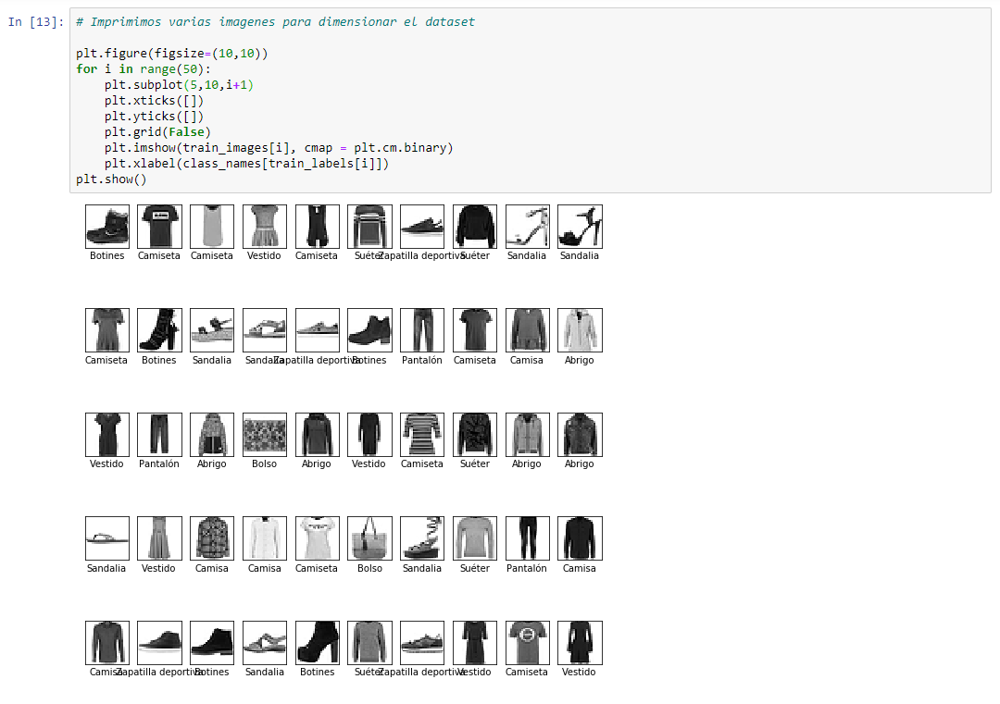

# ML - Deep Learning - Image Recognition

Deep Learning project with Python.

## Description

Using Deep Neural Networks we seek to create an efficient model for image recognition using the Keras dataset "fashion_mnist".

## Herramientas

- Python
- Tensorflow
- TensorBoard
- Numpy
- Matplotlib

## Captures

### Dataset

## Predictions

#### Objective to predict

#### Results of the prediction

### TensorBoard

